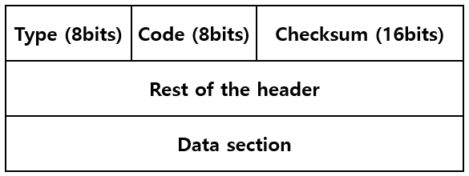
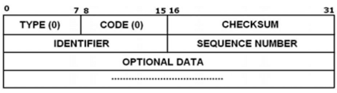

# ft_ping

## ping이 하는 일 한 줄 요약

 > ping은 ICMP Echo Request 패킷을 보내고, Echo Reply가 돌아오는 시간을 재는 도구.

 핵심은 세 가지다.

 - ICMP 프로토콜
 - Raw Socket
 - 왕복 시간 (RTT) 측정

## ICMP

ICMP (Internet Control Message Protocol)는 \
네트워크 계층 (Network layer): 서로 다른 네트워크 간 통신 (IP 주소) 계층에 위치한다.

## IP 프로토콜의 이해
**IP(Internet Protocol)**는 인터넷에서 데이터 패킷을 목적지까지 전달하는 프로토콜 이다.

### IP주소란?
- 인터넷에 연결된 모든 기기는 고유한 IP 주소를 가집니다
- IPv4 예시: 192.168.0.1 (4개의 숫자, 각각 0-255)
- IPv6 예시: 2001:0db8:85a3:0000:0000:8a2e:0370:7334 (더 긴 형식)

### IP의 특징:
- 비연결성(Connectionless): 데이터를 보내기 전에 연결을 확립하지 않음.
- 신뢰성 없음(Unreliable): 패킷이 제대로 도착했는지 확인하지 않음.
- 최선의 노력(Best Effort): 패킷을 전달하려고 노력하지만, 보장하지는 않음.

이러한 IP의 한계 때문에 ICMP의 필요합니다.

## ICMP란 무엇인가?

### ICMP의 정의

**ICMP(Internet Control Message Protocol)**는 인터넷 프로토콜(IP) 네트워크에서 오류 보고와 진단 정보를 주고받기 위한 프로토콜 입니다.

쉽게 말하면, ICMP는 네트워크의 우체부가 편지 배달 중 문제가 생겼을 때 보내는 알림 쪽지와 같습니다.

### ICMP의 탄생 배경

1981년, Jon Postel이 RFC 777을 통해 ICMP를 처음 제안했고, 1981년 9월 RFC 792로 정식 표준이 되었습니다.

> RFC(Request for Comments)는 인터넷 기술의 표준, 규약, 새로운 연구 결과 등을 정의하고 발표하기 위해 인터넷 표준화 기구(IETF 등) 에서 발행하는 문서

왜 ICMP가 필요했을까?
- IP 자체는 오류 보고 메커니즘이 없습니다
- 패킷이 목적지에 도달하지 못하면, 송신자는 이를 알 수 없습니다
- 네트워크 문제를 진단하고 해결할 방법이 필요했습니다

### ICMP의 핵심 특징
- IP의 일부 : ICMP는 IP위에서 동작하지만, IP 프로토콜의 필수 구성 요소입니다.
- 오류 보고 : 데이터 전송 중 발생한 문제를 알립니다.
- 진단 도구 : 네트워크 연결 상태를 테스트합니다.
- 제어 메시지 : 네트워크 상태와 관련된 정보를 전달합니다.

## ICMP의 구조
### ICMP 메시지 형식
ICMP의 메시지는 IP 패킷 안에 캡슐화 되어 전송됩니다.
> [IP 헤더][ICMP 헤더][ICMP  데이터]

### ICMP 헤더 구조:
>

필드 설명:

1. Type(8비트): ICMP 메시지의 유형
- 0 = Echo Reply (Ping 응답)
- 3 = Destination Unreachable (목적지 도달 불가)
- 8 = Echo Request (Ping 요청)
- 11 = Time Exceeded (시간 초과)
- 등등... 

2. Code (8비트): Type에 대한 세부 정보
- Type 3의 경우:
- Code 0 = Network Unreachable
- Code 1 = Host Unreachable
- Code 3 = Port Unreachable

3. Checksum (16비트): 오류 검출을 위한 체크섬
4. Rest of Header (32비트): Type에 따라 다른 정보 포함

### IP 헤더에서 ICMP 식별
IP 헤더에는 "프로토콜 번호" 필드가 있는데, ICMP는 프로토콜 번호 1번을 사용합니다.
- TCP = 6
- UDP = 17
- ICMP = 1

이를 통해 수신 측은 패킷 내용이 ICMP 메시지임을 알 수 있습니다.

## ICMP 메시지 유형
### 오류 보고 메시지 (Error Messages)

### Type 3 : Destination Unreachable (목적지 도달 불가)
패킷이 목적지에 도달할 수 없을 때 발생합니다.

주요 Code 값:
- Code 0 (Network Unreachable): 네트워크에 도달할 수 없음 \
ex) 라우터가 목적지 네트워크로 가는 경로를 모를 때

- Code 1 (Host Unreachable): 호스트에 도달할 수 없음 \
ex) 네트워크는 찾았지만, 특정 컴퓨터를 찾을 수 없을 때

- Code 2 (Protocol Unreachable): 프로토콜에 도달할 수 없음 \
ex) 목적지 컴퓨터가 해당 프로토콜을 지원하지 않을 때

- Code 3 (Port Unreachable): 포트에 도달할 수 없음 \
ex) 특정 포트에서 실행 중인 프로그램이 없을 때

- Code 4 (Fragmentation Needed): 단편화 필요하지만 DF 플래그 설정됨 \
ex) 패킷이 너무 커서 나눠야 하는데, "나누지 마세요" 플래그가 켜져 있을 때

실제 상황 예시:

> 사용자 컴퓨터 (192.168.1.10) → 웹 서버 (203.0.113.50:80) \
시나리오 1: 웹 서버가 꺼져 있음 \
→ Type 3, Code 1 (Host Unreachable) 발생 \
시나리오 2: 웹 서버는 켜져 있지만 80번 포트에 웹 서버 프로그램이 실행되지 않음 \
→ Type 3, Code 3 (Port Unreachable) 발생

### Type 11: Time Exceeded (시간 초과)
Code 0 (TTL Exceeded): TTL (Time To Live) 이 0이 됨

TTL이란?
- 모든 IP 패킷은 TTL 값을 가집니다 (보통 64 또는 128에서 시작)
- 패킷이 라우터를 하나 지날 때마다 TTL이 1씩 감소
- TTL이 0이 되면, 라우터는 패킷을 버리고 ICMP Time Exceeded 메시지를 송신자에게 보냄

왜 TTL이 필요한가?
- 네트워크에서 패킷이 무한 루프를 돌지 않도록 방지
- 예: 잘못된 라우팅 설정으로 패킷이 같은 경로를 계속 순환할 때

실제 예시:
> 패킷 경로: 컴퓨터 → 라우터1 → 라우터2 → 라우터3 → ... → 목적지 \
TTL = 64로 시작 \
라우터1 통과: TTL = 63 \
라우터2 통과: TTL = 62\
... \
라우터64 통과: TTL = 0 → 패킷 버림, ICMP Time Exceeded 발송

### Type 5: Redirect (경로 재지정)
라우터가 더 나은 경로를 알고 있을 때, 송신자에게 다른 라우터를 사용하라고 알립니다.

예시:
> 컴퓨터 → 라우터A → 목적지 \
\
하지만 라우터A가 알기로는: \
컴퓨터 → 라우터B → 목적지 (더 빠름)\
\
라우터A는 컴퓨터에게 "앞으로는 라우터B를 사용하세요" ICMP Redirect 메시지 전송

### Type 12: Parameter Problem (매개변수 문제)
IP 헤더에 잘못된 값이 있을 때 발생합니다. \
예:
- IP 헤더 길이가 올바르지 않음
- 필수 옵션이 누락됨
- 헤더 체크섬 오류

### 정보성 메시지 (Informational Messages)

### Type 8/0: Echo Request와 Echo Reply (Ping)
가장 유명한 ICMP 메시지입니다. Ping 명령어가 바로 이것을 사용합니다.

작동 방식: \
1. 컴퓨터 A가 컴퓨터 B에게 Echo Request (Type 8) 메시지 전송
2. 컴퓨터 B가 살아있고 작동 중이라면, Echo Reply (Type 0) 메시지로 응답
3. 컴퓨토 A는 응답 시간을 측정하여 네트워크 지연(latency) 계산

>
- Identifier: 여려 Ping 세션을 구분 (보통 프로세서 ID 사용)
- Sequence Number: 각 Echo Request마다 증가 (패킷 순서 추적)
- Data: 임의의 데이터 (보통 알파벳이나 타임스탬프)

실제 Ping 명령어 예시:
```bash
bash$ ping google.com

PING google.com (142.250.207.46): 56 data bytes
64 bytes from 142.250.207.46: icmp_seq=0 ttl=117 time=13.2 ms
64 bytes from 142.250.207.46: icmp_seq=1 ttl=117 time=12.8 ms
64 bytes from 142.250.207.46: icmp_seq=2 ttl=117 time=13.1 ms
```

헤석:
- 64 bytes: Echo Reply 메시지 크기
- icmp_seq: Sequence Number
- ttl=117: 페킷의 남은 TTL 값
- time=13.2 ms: 왕복 시간 (Round-Trip Time, RTT)

### Type 13/14: Timestamp Request와 Timestamp Reply
시간 동기화를 위해 사용됩니다 (현재는 NTP가 더 많이 사용됨).

용도:
- 두 시스템 간의 시간 차이 측정
- 네트워크 지연 시간 정확히 계산

### Type 17/18: Address Mask Request와 Reply
서브넷 마스크 정보를 얻기 위해 사용됩니다. (현재는 DHCP가 더 많이 사용됨)

서브넷 마스크란?
- IP 주소의 어느 부분이 네트워크 주소이고, 어느 부분이 호스트 주소인지 구분
- 예: 255.255.255.0 -> 처음 3개 숫자는 네트워크, 마지막 숫자는 호스트

## ICMP의 실제 활용

### Ping - 연결 테스트 도구

Ping의 역사:
- 1983년 Mike Muuss가 만듦
- 이름은 소나의 "핑" 소리에서 유래

Ping의 활용:

1.기본 연결 테스트

```bash
$ ping 8.8.8.8
```
Google의 DNS 서버에 핑을 보내 인터넷 연결 확인

2.특정 횟수만 핑

```bash
$ ping -c 4 google.com
```
4번만 핑을 보내고 종료 (Windows는 -n 4)

3.패킷 크기 조정

```bash
$ ping -s 1000 google.com
```
1000바이트 크기의 패킷으로 핑 (네트워크 성능 테스트)

4.간격 조정

```bash
$ ping -i 0.2 google.com
```
0.2초마다 핑 전송 (기본값 1초)

#### Ping이 실패하는 이유:

1. Request timeout

 - 목적지가 꺼져 있음
 - 방화벽이 ICMP를 차단
- 네트워크 연결 끊김


2. Destination Host Unreachable

- 라우팅 경로가 없음
- 잘못된 IP 주소


3. TTL expired in transit

- 목적지가 너무 멀어서 TTL이 0이 됨
- 라우팅 루프 발생

### Traceroute - 경로 추적 도구

#### Traceroute의 원리:
 TTL을 조작하여 패킷이 지나는 모든 라우터를 찾아냅니다.

**작동 방식:**

1. TTL=1인 패킷 전송 → 첫 번째 라우터에서 "Time Exceeded" 응답
2. TTL=2인 패킷 전송 → 두 번째 라우터에서 "Time Exceeded" 응답
3. TTL=3인 패킷 전송 → 세 번째 라우터에서 "Time Exceeded" 응답
4. 목적지에 도달할 때까지 반복

실제 예시:

```bash

$ traceroute google.com

traceroute to google.com (142.250.207.46), 30 hops max, 60 byte packets
 1  router.home (192.168.0.1)  1.234 ms  1.156 ms  1.089 ms
 2  10.0.0.1 (10.0.0.1)  8.456 ms  8.123 ms  8.234 ms
 3  isp-gateway.net (203.0.113.1)  12.345 ms  12.123 ms  12.234 ms
 4  core-router1.isp.net (198.51.100.1)  15.678 ms  15.456 ms  15.567 ms
 5  core-router2.isp.net (198.51.100.2)  20.123 ms  20.234 ms  20.345 ms
 6  google-peering.isp.net (198.51.100.10)  25.456 ms  25.567 ms  25.678 ms
 7  142.250.207.46 (142.250.207.46)  28.789 ms  28.890 ms  28.901 ms
```